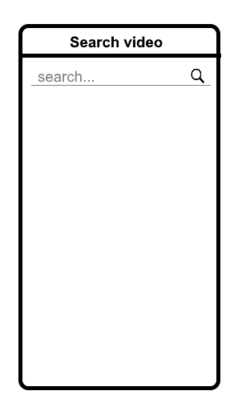
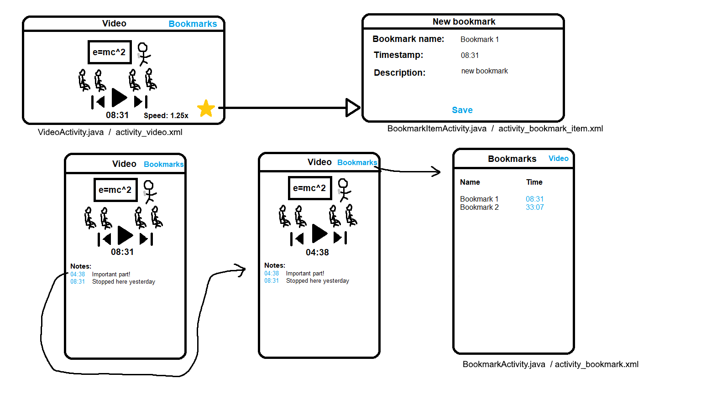

# Design document
#### Title: Video Player (WIP)
#### Name: Ivo de Brouwer

## Advanced sketches of UI

SearchActivity.java / activity_search.xml     			    | other activities
:------------------------------------------------------------------:|:-----------------------------------------:|
   | 

## Class diagram
	
## List of APIs/frameworks and data sources
- [Youtube player API](https://developers.google.com/youtube/android/player/) to load videos.
- Possibly [Firebase](https://firebase.google.com/) to retrieve video data.
