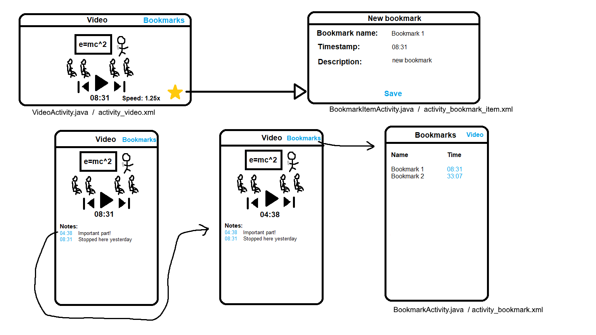

# Project Proposal
#### Title: Video Player (WIP)
#### Name: Ivo de Brouwer

## Problem Statement
When you're watching/listening to a lecture, podcast or other video, you often find yourself in a situation where you want to make notes or add a bookmark to save for later. Unfortunately, most video players for Android don't offer any of this, or are very limited in this regard.
	
## Solution
I want to make a video player in which you can add notes and bookmarks that don't disappear when you close the file or end the session.

	
## Main features
Minimum viable product:

- Basic video player
	
- Bookmarks and notes

Additional features:

- Other video player features like faster playback, rewinding/skipping
	
- Online streaming
	
- Watch videos together from different devices

- ...
	
## Data sources
Video/mp4 files, maybe other files like .avi

Youtube videos through their API
	
	
## External components
Not sure if any so far.
	
## Similar apps
VLC Media Player is the most popular video player on Android with bookmarks, but those disappear on session end etc.
PotPlayer works fine, but is only for Windows, not Android.
	
## Hardest parts to implement
Implementing and saving the bookmarks through sessions will likely be tough. The additional features will also be hard to implement.
